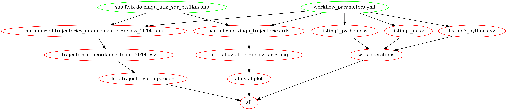

# A plataform for land use and land cover data integration and trajectory analysis

[](#)
[](https://mybinder.org/v2/gh/M3nin0/wlts-compendium/HEAD)

This repository is a `Research Compendium` (RC), with all the materials
(codes, data, and computational environment) required for the
reproduction and evaluation of the results presented in the article:

> Zioti *et al*, (2021).
> `A plataform for land use and land cover data integration and trajectory analysis`.
> International Journal of Applied Earth Observation and Geoinformation
> (2021).

## Compendium content

The **analysis** directory contains:

-   [:file\_folder: analysis/scripts/](analysis/scripts/): Directory
    where all the Jupyter Notebooks used for generating the article
    results are stored. It has three subdirectories, namely:

    -   [:file\_folder:
        analysis/scripts/wlts-operations](analysis/scripts/wlts-operations):
        Directory with Jupyter Notebooks that contains the example *code
        listings* used in the article for presenting how the services of
        the platform described in the article work;

    -   [:file\_folder:
        analysis/scripts/sankey-plot](analysis/scripts/sankey-plot):
        Directory with the Jupyter Notebooks used for Sankey Plot
        generation from land use and land cover trajectories retrieved
        from the TerraClass Amazonia collection;

    -   [:file\_folder:
        analysis/scripts/lulc-trajectory-comparison](analysis/scripts/lulc-trajectory-comparison):
        Directory with the Jupyter Notebooks used for generating the
        concordance analysis between the TerraClass Amazonia and
        MapBiomas (V5) collections.

-   [:file\_folder: analysis/data/](analysis/data): Directory where the
    input and output data is stored. It has the following
    subdirectories:

    -   [:file\_folder:
        analysis/data/raw\_data/](analysis/data/raw_data/): Directory
        with the input data. It has the following elements:

        -   [:file\_folder:
            analysis/data/raw\_data/study-area\_sao-felix-do-xingu/](analysis/data/raw_data/study-area_sao-felix-do-xingu/):
            Directory with the shapefile from the regularly spaced grid
            of 1x1 km used in the workflow analysis;

        -   [analysis/data/raw\_data/terraclass\_amazonia\_v2\_color-palette.yml](analysis/data/raw_data/terraclass_amazonia_v2_color-palette.yml):
            File with the definition of the color palette used in the
            Sankey Plot of the TerraClass data collection;

        -   [analysis/data/raw\_data/workflow\_parameters.yml](analysis/data/raw_data/workflow_parameters.yml):
            Workflow configuration file. This file should be used when
            the full run is done with the `Makefile`.

    -   [:file\_folder:
        analysis/data/derived\_data/](analysis/data/derived_data):
        Directory with the output data. Content is added as the workflow
        runs.

In addition to these directories, the following files are available in
the root of this RC (Separated by type):

**Environment**

-   `docker-compose.yml`: File that facilitates the creation and use of
    the computing environment provided in the `Dockerfile`;
-   `Dockerfile`: File with all the instructions needed to build the
    environment used to execute the scripts provided in this RC. The
    environment specified in this file has a [Jupyter
    Lab](https://jupyterlab.readthedocs.io/en/stable/) that allows
    interactive execution of the codes;
-   `environment.yml`: Conda environment description file, with the
    dependencies and their versions, used in the production of the
    results of the article and necessary for the reproduction of the
    results of the article.

**Utilities**

`Makefile` with the definition of rules that make up all the operations
that need to be performed to reproduce all the results presented in the
article, which includes building the Docker environment as well as
running the workflow itself.

<details>
<summary>
Click here to visualize the avaliable rules in the Makefile
</summary>

``` sh
all                            (Workflow) Execute all workflow steps.
clean                          (Workflow) Remove all workflow results.
compose-build                  (Environment) Build the Docker Image of the environment needed to run the code.
compose                        (Environment) Build the Docker Image and start it for code execution on a Jupyter Lab environment.
compose-up                     (Environment) Start the Docker Container with a Jupyter Lab for code execution.
generate-make-graph            (Miscellaneous) Generate make dependencies as a graph
lulc-trajectory-comparison     (Workflow) Execute the notebooks to generate the Agreement analysis presented in the paper.
sankey-plot                    (Workflow) Execute the notebooks to generate the Sankey Plot presented in the paper.
wlts-operations                (Workflow) Execute the notebooks with the WLTS and WLCCS base operations presented in the paper.
```

</details>

<br>

`Workflow`: For the execution of the workflow, the Makefile has three
rules:

-   `wlts-operations`: Run the Jupyter Notebooks in the directory
    `analysis/scripts/wlts-operations`. These run the example code
    listings presented in this CR article. It is recommended that you
    run these Notebooks in interactive mode to make it easier to
    understand and use each operation performed;

-   `sankey-plot`: Run the Jupyter Notebooks in the
    `analysis/scripts/sankey-plot` directory, which extracts the
    trajectories and then uses them to create the Sankey Plot;

-   `lulc-trajectory-comparison`: Run the Jupyter Notebooks in the
    `analysis/scripts/lulc-trajectory-comparison` directory, which
    extracts the harmonized trajectories and then uses them to create a
    confusion matrix for a concordance analysis.

Each of these rules has no dependencies on the other. However, note that
for the `sankey-plot` rule, two Jupyter Notebooks are executed, which
are dependent on each other, one being used for the extraction of
trajectories and the other for the creation of the Sankey Plot. The
behavior is analogous to the `lulc-trajectory-comparison` rule, where
two notebooks are executed, each responsible for one stage of the
concordance analysis.

<details>
<summary>
Click here to visualize the dependency graph of the Makefile for the
workflow rules
</summary>

<div align="center">



</div>

</details>

<br>

`Environment`: The environment rules facilitate the construction of the
computing environment, based on Docker, available in this RC to execute
the codes. The following rules are available:

-   `compose-build`: Command to build the Docker Image of the
    environment needed to run the code;
-   `compose-up`: Command to start the computational environment for
    code execution;
-   `compose`: Command to build and run at once.

`Miscelaneous`: General Makefile rules that are available. Currently,
you have in this category the following rule:

-   `generate-make-graph`: Create the Makefile dependency graph
    presented above.

## Running

In this section, the way the code in this RC can be executed is
presented. The alternative to performing each of the steps is the
`Makefile` file available in this RC. In this file, the compose
operation is available, which performs all the steps presented below for
the configuration of the environment necessary for executing the codes.
The use of the `Makefile`, can be done in a terminal, inside this RC,
with the following command:

``` sh
make compose
```

To reproduce the results, it is necessary to configure the computational
environment where the codes will be executed, for which at least two
approaches can be used. In the first one, the environment is built using
the `Dockerfile`.

> The steps presented below assume that the user has installed the
> [Docker](https://www.docker.com/) and [Docker
> Compose](https://docs.docker.com/compose/) tools. If you have not
> installed them, please refer to the official documentation for each of
> these tools:

> 1.  [Install Docker Engine](https://docs.docker.com/engine/install/);
> 2.  [Install Docker
>     Compose](https://docs.docker.com/compose/install/).

To build the environment, in a terminal, use the following
`Docker Compose` command:

``` sh
docker-compose build --no-cache

#> Building with native build. Learn about native build in Compose here: https://docs.docker.com/go/compose-native-build/
#> Building wlts-paper-environment
#> ... (Omitted)
#> Removing intermediate container f5e8ec885700
#> ---> b9bdc015280d
#> Successfully built b9bdc015280d
#> Successfully tagged wlts-paper-environment:0.1
```

An alternative is to use the `compose-build` operation available in the
`Makefile` of this RC:

``` sh
make compose-build
```

In both commands, the Docker Image that will be used was built. With the
image generated, you can run it. For example, to do this with
`Docker Compose`, use the following command:

``` sh
docker-compose up

#> ... (Omitted)
#> wlts-paper-environment-container |         http://6d8cc29ce16c:8888/lab?token=34f53953650472abf5aaecd040ac85b68992ef470a74bcc8
#> wlts-paper-environment-container |      or http://127.0.0.1:8888/lab?token=34f53953650472abf5aaecd040ac85b68992ef470a74bcc8
```

The same process can be done with the `Makefile`:

``` sh
make compose-up
```

Once this is done, it will be necessary to access the address (with the
token) shown in the command output. For example, in this case, using the
output of the above command, the following address can be accessed in
the browser:

``` sh
firefox http://127.0.0.1:8888/lab?token=34f53953650472abf5aaecd040ac85b68992ef470a74bcc8
```

Once you access this address in your browser, a Jupyter Lab environment
will be available, ready for executing the code in this RC. To start
executing and exploring the available code, go to the `wlts-article`
directory, which contains all the content of this CR, following the
organizational structure presented above.

### Licenses

**Code :** [MIT](LICENSE);

**Data :** [CC-0](http://creativecommons.org/publicdomain/zero/1.0/);

**Text and figures:**
[CC-BY-4.0](http://creativecommons.org/licenses/by/4.0/);
