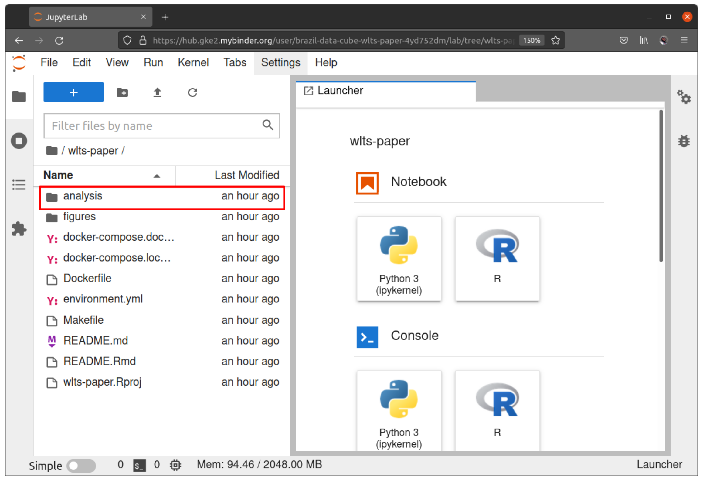
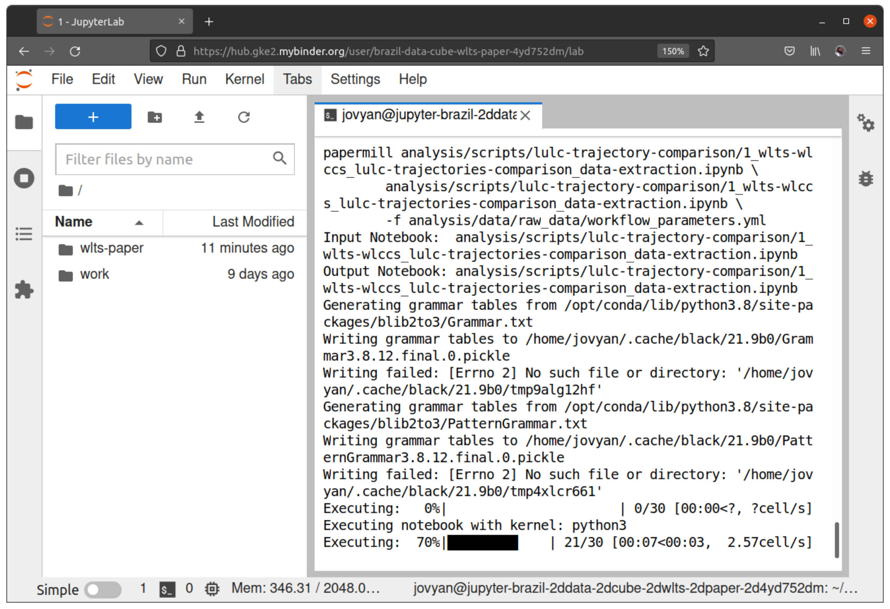

# A plataform for land use and land cover data integration and trajectory analysis

[](#)
[](https://mybinder.org/v2/gh/brazil-data-cube/wlts-paper/HEAD)

This repository is a `Research Compendium` (RC), with all the materials
(codes, data, and computational environment) required for the
reproduction and evaluation of the results presented in the article:

> Zioti *et al.* (2021).
> `A plataform for land use and land cover data integration and trajectory analysis`.
> Paper submitted for International Journal of Applied Earth Observation
> and Geoinformation (2021).

## Compendium content

The directory **analysis**, centralizes the codes and data used in the
RC. It has two subdirectories, the first of which, **analysis/data**,
stores the input and output data in the following structure:

-   [:file\_folder: analysis/data/raw\_data/](analysis/data/raw_data/):
    Directory with the input data. It has the following elements:

    -   [workflow\_parameters.yml](analysis/data/raw_data/workflow_parameters.yml):
        Workflow configuration file. This file should be used when the
        full run is done with the `Makefile`;

    -   [study-area\_sao-felix-do-xingu](analysis/data/raw_data/study-area_sao-felix-do-xingu/):
        Directory with the shapefile from the regularly spaced grid of
        1x1 km used in the workflow analysis;

    -   [terraclass\_amazonia\_v2\_color-palette.yml](analysis/data/raw_data/terraclass_amazonia_v2_color-palette.yml):
        File with the definition of the color palette used in the
        alluvial plot.

-   [:file\_folder:
    analysis/data/derived\_data/](analysis/data/derived_data/):
    Directory with the output data. By default, these directories are
    kept empty in the repository, requiring code execution to generate
    results. This directory has the following elements:

    -   [alluvial-plot](analysis/data/derived_data/alluvial-plot/):
        Directory to save the alluvial plot figure;

    -   [base-operations](analysis/data/derived_data/base-operations/):
        Directory to save the code listings (article examples) outputs;

    -   [lulc-trajectory-comparison](analysis/data/derived_data/lulc-trajectory-comparison/):
        Directory to save the agreement analysis results.

The second **analysis** subdirectory is the **analysis/scripts**
directory, which stores the codes for this RC. It has the following
elements:

-   [:file\_folder: alluvial-plot](analysis/scripts/alluvial-plot/):
    Jupyter Notebooks to generate the alluvial plot;

-   [:file\_folder: wlts-operations](analysis/scripts/wlts-operations/):
    Jupyter Notebooks with the code listings presented in the paper;

-   [:file\_folder:
    lulc-trajectory-comparison](analysis/scripts/lulc-trajectory-comparison/):
    Jupyter Notebooks for agreement analysis.

Besides these directories, there are also files used for the
specification of the computing environment needed to run the Jupyter
Notebooks:

-   `docker-compose.local.yml`: File with instructions for building and
    running the Docker environment provided in this RC;

-   `docker-compose.dockerhub.yml` (No local build required): File with
    instructions for running the Docker environment provided in this RC.
    Uses the Docker Image provided on DockerHub;

-   `environment.yml`: Conda environment description file, with the
    dependencies and their versions, used in the production of the
    results of the article and necessary for the reproduction of the
    results of the article;

-   `Dockerfile`: Docker Image specification file. It is based on the
    packages and versions specified in the `environment.yml` file.

In addition to these, there is also the `Makefile` where the workflow of
this RC is modeled.

## Running

This section will present the steps required to use the code and data
materials provided in this RC. First, the configuration of the
environment needed to run the codes will be done. Next, we will present
the available ways to run the codes. The details of each of these steps
are described in the sections below.

### Environment

During the production of this RC, the code execution to obtain the
results was done based on an environment with several software libraries
installed. To make the codes execution and the results generated
reproducible, we prepared a description of the environment used,
declaring the software libraries used and their versions. With this
description, others can run the codes in this RC from the same software
libraries, avoiding possible incompatibility.

To produce the environment description, we first organized and specified
all the software and versions used to make the paper’s results. We do
this with the [Conda](https://docs.conda.io/en/latest/) package manager
because it allows the management of packages of both languages used in
the paper (R and Python). The result is the file
[environment.yml](environment.yml), which describes all the versions and
packages used. Next, we used this environment description to produce a
Docker Image, in which all the packages described in the file
[environment.yml](environment.yml) were installed. To enable the
interactive use of the generated environment, the Docker Image created
was based on the Docker Image
[jupyter/base-notebook:lab-3.1.13](https://hub.docker.com/layers/jupyter/base-notebook/lab-3.1.13/images/sha256-9a388da87e9d2b8019df20439977953d0576f6168348f621498ac62b45e2f88f?context=explore),
in which the installation of
[JupyterLab](https://jupyterlab.readthedocs.io/en/stable/) was
available. With JupyterLab, users can interact with the environment
through an interactive, high-level interface with features that
facilitate code and data analysis. The connection of each of these
elements in the produced environment is depicted in Figure 1.

<div align="center">


<b>Figure 1.</b> Environment building flow.

</div>

At the moment the Docker Image is being generated, all the RC components
are copied into it. This way, when accessing the JupyterLab interface to
use the environment, the user already has available, in a directory
named `wlts-paper`, the whole RC. Figure 2 shows the JupyterLab
interface, which is made available to the user, along with the RC
contents listed from the `wlts-paper` directory.

<div align="center">


<b>Figure 2.</b> Environment `wlts-paper` directory.

</div>

This way of specifying and making the environment available, based on
Docker, allows the material in this RC, especially the codes, to be used
in the same way as the authors did during the production of the results.
The configuration and use of this environment can be done in several
ways. In the topics below, we will present some of the ways to configure
and use this environment.

> The different approaches presented below, used for configuring and
> running the environment, do not change its content. Thus, all the
> properties defined above are valid for any of the ways of configuring
> the environment.

#### Binder

The first available option for using the computational environment is
with [Binder](https://jupyter.org/binder), a tool that allows the
creation and sharing of executable environments from code repositories.
With Binder, all you need to do to access the executable environment of
this RC is click on the icon below:

<div align="center">

[](https://mybinder.org/v2/gh/brazil-data-cube/wlts-paper/HEAD)

</div>

When you access the link, the Binder will create the executable
environment with the same libraries and versions specified in the
[environment.yml](environment.yml) file. When the environment is ready
for use, you will have to access it via a
[JupyterLab](https://jupyterlab.readthedocs.io/en/stable/) interface.
The JupyterLab page that you will have access to is shown in Figure 3.

<div align="center">


<b>Figure 3.</b> JupyterLab on Binder.

</div>

After accessing the environment, you are ready to run these
environments. To understand how the code is organized and how it can be
executed, please go to Section [Workflow
execution](#workflow-execution).

**Extra**: Using the link mentioned above summarizes the operations and
makes access to the environment direct. If the reader is interested, the
step-by-step instructions for using Binder are available below. We
recommend using this material as a reference to the behavior that Binder
should exhibit throughout the environment configuration steps.

<details>
<summary>
Step-by-step environment setup in Binder
</summary>

<br/>

> This step-by-step is an extended version of the tutorial presented
> earlier on using the computing environment with Binder. If your
> environment is already working, we recommend that you skip these steps

To get started, go to <https://mybinder.org/>:

<div align="center">


<b>Figure 4.</b> mybinder.org.

</div>

<br>

On the <https://mybinder.org/> page, enter in the *GitHub repository
name or URL* field the repository address of this RC:

    https://github.com/brazil-data-cube/wlts-paper

Now, click on the **launch** button.

<div align="center">


<b>Figure 5.</b> RC repository configuration.

</div>

<br>

When you click **launch**, Binder will start loading the repository and
building the environment you will work. The process may take a few
minutes. At the end of the operation, the loading bar will reach the
end, where the option (in green) **Launching** will be presented:

<div align="center">


<b>Figure 6.</b> RC repository launching.

</div>

After the building process, the environment is loaded, and you are
redirected to the JupyterLab page:

<div align="center">


<b>Figure 7.</b> JupyterLab frontpage on Binder.

</div>

</details>

<br>

#### Local machine (with DockerHub Image)

> During the production of this RC, all testing was performed using the
> Linux environment. Therefore, the commands below may change slightly
> on other operating systems.

The second option available is to use the RC environment directly on the
user’s machine via
[Docker](https://docs.docker.com/get-started/overview/). In this option,
the user runs the [Docker
Image](https://docs.docker.com/get-started/overview/#docker-objects) of
this RC made available on DockerHub, which is ready to use, requiring no
build steps. Below are the steps required to use this approach.

> The steps presented below assume that the user has installed the
> [Docker](https://www.docker.com/) and [Docker
> Compose](https://docs.docker.com/compose/) tools. If you have not
> installed them, please refer to the official documentation for each of
> these tools:

> 1.  [Install Docker Engine](https://docs.docker.com/engine/install/);
> 2.  [Install Docker
>     Compose](https://docs.docker.com/compose/install/).

> Additionally, the user is expected to have [git](https://git-scm.com/)
> installed on the machine. If you do not, please refer to the git
> [official documentation](https://git-scm.com/download/linux) to do the
> installation.

> The versions of each of these tools used in the production of this
> material are available below.

<details>
<summary>
Docker, Docker Compose, and Git versions used for the production of this
RC.
</summary>

**git**

``` sh
git --version

#> git version 2.27.0
```

**Docker**

``` sh
docker version

#> Client: Docker Engine - Community
#>  Version:           20.10.8
#>  API version:       1.41
#>  Go version:        go1.16.6
#>  Git commit:        3967b7d
#>  Built:             Fri Jul 30 19:54:09 2021
#>  OS/Arch:           linux/amd64
#>  Context:           default
#>  Experimental:      true

#> Server: Docker Engine - Community
#>  Engine:
#>   Version:          20.10.8
#>   API version:      1.41 (minimum version 1.12)
#>   Go version:       go1.16.6
#>   Git commit:       75249d8
#>   Built:            Fri Jul 30 19:52:16 2021
#>   OS/Arch:          linux/amd64
#>   Experimental:     false
#>  containerd:
#>   Version:          1.4.9
#>   GitCommit:        e25210fe30a0a703442421b0f60afac609f950a3
#>  runc:
#>   Version:          1.0.1
#>   GitCommit:        v1.0.1-0-g4144b63
#>  docker-init:
#>   Version:          0.19.0
#>   GitCommit:        de40ad0
```

**Docker Compose**

``` sh
docker-compose --version

#> docker-compose version 1.28.2, build 67630359
```

</details>

<br/>

To use this local approach, the first step is to download the repository
for this RC. To do this, in a terminal on your machine, use `git` and
clone the repository:

``` sh
git clone https://github.com/brazil-data-cube/wlts-paper

#> remote: Enumerating objects: 159, done.
#> remote: Counting objects: 100% (159/159), done.
#> remote: Compressing objects: 100% (110/110), done.
#> remote: Total 159 (delta 61), reused 136 (delta 40), pack-reused 0
#> Receiving objects: 100% (159/159), 1.55 MiB | 10.57 MiB/s, done.
#> Resolving deltas: 100% (61/61), done.
```

After the clone, in the directory you are in, there should be a
directory named `wlts-paper`:

``` sh
ls -l

#> drwxrwxr-x 6 felipe felipe    4096 out  4 17:46 wlts-paper
```

Access this directory and view its contents:

``` sh
cd wlts-paper

ls -l
#> drwxrwxr-x 5 felipe felipe  4096 out  3 17:00 analysis
#> -rw-rw-r-- 1 felipe felipe   272 out  4 11:09 docker-compose.dockerhub.yml
#> -rw-rw-r-- 1 felipe felipe   303 out  4 11:09 docker-compose.local.yml
#> -rw-rw-r-- 1 felipe felipe   739 out  4 13:57 Dockerfile
#> -rw-rw-r-- 1 felipe felipe 10895 out  4 09:46 environment.yml
#> drwxrwxr-x 4 felipe felipe  4096 out  4 14:30 figures
#> -rw-rw-r-- 1 felipe felipe  3771 out  4 11:10 Makefile
#> -rw-rw-r-- 1 felipe felipe 22614 out  4 17:52 README.md
#> -rw-rw-r-- 1 felipe felipe 23496 out  4 17:53 README.Rmd
#> -rw-rw-r-- 1 felipe felipe   226 out  4 10:47 wlts-paper.Rproj
```

In the `wlts-paper` directory, notice the `docker-compose.dockerhub.yml`
file; this contains the instructions for running a [Docker
Container](https://docs.docker.com/get-started/overview/#docker-objects)
from the image of this RC that is available on DockerHub. So, use this
file to run this RC environment:

``` sh
docker-compose -f docker-compose.dockerhub.yml up
```

If everything is correct so far, running the above command should
produce the output shown below:

    (Omitted)

    wlts-paper-environment-container |     
    wlts-paper-environment-container |     To access the server, open this file in a browser:
    wlts-paper-environment-container |         file:///home/jovyan/.local/share/jupyter/runtime/jpserver-8-open.html
    wlts-paper-environment-container |     Or copy and paste one of these URLs:
    wlts-paper-environment-container |         http://6fec052c07e8:8888/lab?token=b49897a7c22065285d3b9d942ffd86921eef44dbb64eeabc
    wlts-paper-environment-container |      or http://127.0.0.1:8888/lab?token=b49897a7c22065285d3b9d942ffd86921eef44dbb64eeabc

This information allows access to the JupyterLab page. So, to access
this environment, copy the URL displayed in your terminal output that
includes the Jupyter access token. The copied address should look like
the one shown below:

> Remember that this address and token vary with each run, so copy it
> from your terminal. If you try to log in with the token shown below,
> you will have problems using Jupyter.

``` sh
http://127.0.0.1:8888/lab?token=b49897a7c22065285d3b9d942ffd86921eef44dbb64eeabc
```

After copying the URL, access it using any browser of your choice. As an
example, to access this URL with firefox, you can use the command in the
terminal:

``` sh
firefox http://127.0.0.1:8888/lab?token=b49897a7c22065285d3b9d942ffd86921eef44dbb64eeabc
```

When you go there, you should see the JupyterLab page (Figure 3). Once
you have done this, you are ready to start executing the code in this
RC. Go to the Section [Workflow execution](#workflow-execution).

#### Local machine (with Docker build)

> During the production of this RC, all testing was performed using the
> Linux environment. Therefore, the commands below may change slightly
> on other operating systems.

As an alternative version of the option presented in subsection [Local
machine (with DockerHub Image)](local-machine-with-dockerhub-image),
this third option is also available. In this option, analogous to the
previous subsection, the user downloads the RC content to his machine
and runs it from a Docker Container with all the environment configured
and ready to use. The difference in this third alternative is that the
[Docker
Image](https://docs.docker.com/get-started/overview/#docker-objects)
version is created on the user’s machine, and no ready-to-use image is
used.

The steps for using this approach are presented below.

> This approach is recommended for users who already know Docker and
> want to rebuild the environment from scratch.

To use this local approach with Docker Image build, the first step is to
download the repository for this RC. To do this, in a terminal on your
machine, use `git` and clone the repository:

``` sh
git clone https://github.com/brazil-data-cube/wlts-paper

#> remote: Enumerating objects: 159, done.
#> remote: Counting objects: 100% (159/159), done.
#> remote: Compressing objects: 100% (110/110), done.
#> remote: Total 159 (delta 61), reused 136 (delta 40), pack-reused 0
#> Receiving objects: 100% (159/159), 1.55 MiB | 10.57 MiB/s, done.
#> Resolving deltas: 100% (61/61), done.
```

After the clone, in the directory you are in, there should be a
directory named `wlts-paper`:

``` sh
ls -l

#> drwxrwxr-x 6 felipe felipe    4096 out  4 17:46 wlts-paper
```

Access this directory and view its contents:

``` sh
cd wlts-paper

ls -l
#> drwxrwxr-x 5 felipe felipe  4096 out  3 17:00 analysis
#> -rw-rw-r-- 1 felipe felipe   272 out  4 11:09 docker-compose.dockerhub.yml
#> -rw-rw-r-- 1 felipe felipe   303 out  4 11:09 docker-compose.local.yml
#> -rw-rw-r-- 1 felipe felipe   739 out  4 13:57 Dockerfile
#> -rw-rw-r-- 1 felipe felipe 10895 out  4 09:46 environment.yml
#> drwxrwxr-x 4 felipe felipe  4096 out  4 14:30 figures
#> -rw-rw-r-- 1 felipe felipe  3771 out  4 11:10 Makefile
#> -rw-rw-r-- 1 felipe felipe 22614 out  4 17:52 README.md
#> -rw-rw-r-- 1 felipe felipe 23496 out  4 17:53 README.Rmd
#> -rw-rw-r-- 1 felipe felipe   226 out  4 10:47 wlts-paper.Rproj
```

In the `wlts-paper` directory, notice the `docker-compose.local.yml`
file. This file contains the instructions for building and running this
RC environment. So, with `Docker Compose`, use this file to build the
Docker Image environment:

``` sh
docker-compose -f docker-compose.local.yml build --no-cache
```

After the build, the Docker Image
`brazildatacube/wlts-paper-environment:0.1-local` should be available in
your environment. So when you list the Docker Images on your machine,
this image should appear, as shown below:

``` sh
docker image ls

#> REPOSITORY                                TAG          IMAGE ID           CREATED         SIZE
#> brazildatacube/wlts-paper-environment  0.1-local     dd1aa5640e41   About a minute ago   5.05GB
```

You can then start [Docker
Container](https://docs.docker.com/get-started/overview/#docker-objects)
from the created Docker Image. To do this, use `Docker Compose` again:

``` sh
docker-compose -f docker-compose.local.yml up
```

If everything is correct so far, running the above command should
produce the output shown below:

    (Omitted)

    wlts-paper-environment-container | [C 2021-10-04 21:59:46.336 ServerApp] 
    wlts-paper-environment-container |     
    wlts-paper-environment-container |     To access the server, open this file in a browser:
    wlts-paper-environment-container |         file:///home/jovyan/.local/share/jupyter/runtime/jpserver-7-open.html
    wlts-paper-environment-container |     Or copy and paste one of these URLs:
    wlts-paper-environment-container |         http://bc26c6560801:8888/lab?token=8e487aba8f7b007a92ac3906b801f7e7fff299d0062c2cb1
    wlts-paper-environment-container |      or http://127.0.0.1:8888/lab?token=8e487aba8f7b007a92ac3906b801f7e7fff299d0062c2cb1

This information allows access to the JupyterLab page. So, to access
this environment, copy the URL displayed in your terminal output that
includes the Jupyter access token. The copied address should look like
the one shown below:

> Remember that this address and token vary with each run, so copy it
> from your terminal. If you try to log in with the token shown below,
> you will have problems using Jupyter.

``` sh
http://127.0.0.1:8888/lab?token=8e487aba8f7b007a92ac3906b801f7e7fff299d0062c2cb1
```

After copying the URL, access it using any browser of your choice. As an
example, to access this URL with firefox, you can use the command in the
terminal:

``` sh
firefox http://127.0.0.1:8888/lab?token=8e487aba8f7b007a92ac3906b801f7e7fff299d0062c2cb1
```

When you go there, you should see the JupyterLab page (Figure 3). Once
you have done this, you are ready to start executing the code in this
RC. Go to the Section [Workflow execution](#workflow-execution).

### Workflow execution

> To follow the steps in this section, you must already have a
> executable environment set up and ready to go. If not, please refer to
> Section [Environment](#environment).

> Note that for all the workflow execution code and configurations, it
> will be assumed that the executions performed are **always** relative
> to the directory `wlts-paper`. This directory contains all the
> materials in this RC and is available in the environment configured
> with the approaches presented in Section [Environment](#environment).

> The **W**eb **L**and **T**rajectory **S**ervice (WLTS) and **W**eb
> **L**and **C**over **C**lassification **S**ystem (WLCCS) services used
> to run these notebooks are provided by the Brazil Data Cube (BDC)
> project. However, to use these and other BDC services, creating a free
> `access token` is necessary. If you do not have a BDC access token,
> please refer to the BDC services [documentation](#) page for
> information on creating one.

The materials provided in this RC complement the examples and explain
how we conducted the analyses in the paper. To consistently organize
these examples and analyses, we created a workflow consisting of three
independent parts in this RC. In all parts of the workflow, the codes
were organized into interactive Jupyter Notebooks, which explain the
operations performed.

Figure 8 illustrates the workflow parts and the Jupyter Notebooks that
compose them, along with their connections and orders. The execution of
each of these parts does not depend on each other, making their
exploration simpler. Below are the details of the elements that make up
the workflow presented. Afterward, we will describe the ways of using
and executing this workflow.

<div align="center">


<b>Figure 8.</b> Workflow overview.

</div>

<br/>

#### Base operations

> The notebooks from this workflow step are available in the directory:
> `analysis/scripts/wlts-operations`.

The `Base operations` is the part of the workflow that contains the
example code listings presented in the article. This workflow part has
two Jupyter Notebooks:

-   `wlts-operations-python.ipynb`: Jupyter Notebook with the example
    code listings of Python client usage available for access to the
    platform presented by Zioti *et al.* (2021);
-   `wlts-operations-r.ipynb`: Jupyter Notebook with the R client
    example code listings available for access to the platform presented
    by Zioti *et al.* (2021).

As shown in Figure 8, both of these notebooks have no dependencies on
each other, allowing them to be run in no particular order.

#### Alluvial Plot

> The notebooks from this workflow step are available in the directory:
> `analysis/scripts/alluvial-plot`.

The `Alluvial plot` is part of the workflow containing the codes used to
produce the alluvial plot presented by Zioti *et al.* (2021). This
workflow part has two Jupyter Notebooks:

-   `1_wlts_alluvial-plot_data-extraction.ipynb`: Document with the
    codes used for retrieving the LULC trajectories used as the basis
    for producing the Alluvial plot;
-   `2_wlts_alluvial-plot_data-visualization.ipynb`: Document with the
    codes used to produce the Alluvial plot. Uses as a base the LULC
    trajectories retrieved’ in the notebook
    `1_wlts_alluvial-plot_data-extraction.ipynb`.

Thus, as shown in Figure 8, the notebooks used for the generation of the
alluvial plot have a dependency relationship, making the order of
execution relevant. When this relation is not preserved, there are
problems in the result production.

#### LULC Trajectory comparison

> The notebooks from this workflow step are available in the directory:
> `analysis/scripts/lulc-trajectory-comparison`.

The `LULC Trajectory comparison` is the part of the workflow that
contains the codes used for producing the agreement analysis between
trajectories. For the production of this analysis. This workflow part
has two Jupyter Notebooks:

-   `1_wlts-wlccs_lulc-trajectories-comparison_data-extraction.ipynb`:
    Document with the codes for retrieving LULC trajectories;
-   `2_wlts-wlccs_lulc-trajectories-comparison_analysis.ipynb`: Document
    with the codes for producing the agreement analysis with the
    trajectories retrieved in the notebook
    `1_wlts-wlccs_lulc-trajectories-comparison_data-extraction.ipynb`.

Therefore, as with the Alluvial plot, the execution of these notebooks
has an execution order, which is shown in Figure 8.

### Parametrized batch using GNU Make

> You must run the codes presented in this section in an environment
> with the dependencies presented in the
> [environment.yml](environment.yml). If necessary, please refer to
> Section [Environment](#environment) to configure your environment.

The first workflow execution mode for this RC is the parameterized
batch. Here, each of the parts of the workflow is executed individually,
from start to finish, without any user interaction. This execution mode
is recommended for the users who wish to obtain the results without
having to access and run the notebooks manually.

To implement this execution mode, the following tools were used:

-   [GNU Make](https://www.gnu.org/software/make/): Para a modelagem e
    execução do workflow;
-   [Papermill](https://papermill.readthedocs.io/en/latest/): Ferramenta
    para a execução parametrizada, via terminal, de Jupyter Notebooks.

By using these tools together, we model all the parts of the workflow
and manage its execution without the need to modify the code or even
change the format (e.g., take the code out of Jupyter Notebooks and send
it to conventional Python scripts).

#### Makefile

> If the reader is interested in learning `Make`, please see the page
> [Reproducibility with
> Make](https://the-turing-way.netlify.app/reproducible-research/make.html).

To use `GNU Make`, we have made a `Makefile` that materializes the whole
workflow through [make
rules](https://www.gnu.org/software/make/manual/html_node/Rules.html).
The following rules are available:

> **Tip**: To view these rules directly from the Makefile, you can run
> the command in the root directory of this RC: `make help`.

    alluvial-plot                  (Workflow) Execute the notebooks to generate the Alluvial Plot presented in the paper.
    all                            (Workflow) Execute all workflow steps.
    clean                          (Workflow) Remove all workflow results.
    generate-make-graph            (Miscellaneous) Generate a graph from the Makefile rules
    lulc-trajectory-comparison     (Workflow) Execute the notebooks to generate the Agreement analysis presented in the paper.
    wlts-operations                (Workflow) Execute the notebooks with the WLTS and WLCCS base operations presented in the paper.

Each of the `wlts-operations`, `alluvial-plot`, and
`lulc-trajectory-comparison` rules represent the parts of the workflow
presented above. Additionally, the rules `all` and `clean` are used
respectively for performing all the workflow steps and cleaning up all
the results generated by the notebooks.

The connection of all these rules can be seen as a dependency graph,
which is generated with the
[makefile2graph](https://github.com/lindenb/makefile2graph) tool .

<details>
<summary>
Click here to visualize the Makefile dependencies graph
</summary>

<div align="center">


<b>Figure 9.</b> Makefile dependency graph.

</div>

</details>

<br>

In the following sections, how each of these rules is used to execute
this RC workflow will be presented.

#### Parameterization

Batch mode execution, once started, does not allow user interaction
until its completion. However, in this RC, an `access token` is required
to retrieve the trajectories from the WLTS and WLCCS services provided
by the BDC project.

To avoid having to specify this `access token` to each Jupyter Notebook
before execution in batch mode, we use the notebook execution
parameterization capabilities provided by the `papermill`. This
`papermill` functionality allows all notebooks that require this
information to receive it from a single definition of the
`access token`, made in a configuration file.

Thus, before starting executions of the parts of the workflow, it is
necessary to create this configuration file. In this RC, this
configuration file is in the path
`analysis/data/raw_data/workflow_parameters.yml`. When you access it,
you will see a file with the following format:

> Remember that the path `analysis/data/raw_data/` is relative to the RC
> root directory. So, for example, if you use the environment set up
> with some of the approaches presented in Section
> [Environment](#environment), this path will be relative to the
> `wlts-paper` directory.

    bdc_access_token: "YOUR-BDC-SERVICES-TOKEN-HERE"

Change the file’s contents, replacing the text
`YOUR-BDC-SERVICES-TOKEN-HERE` with your BDC `access token`. By doing
this, you are now ready to run the workflow in batch mode.

<details>
<summary>
Click here for the step-by-step configuration of the access token
parameter (Optional)
</summary>

<br/>

> If you are having trouble setting up the `workflow_parameters.yml`
> file, use the steps below. If you have already done the setup, it is
> not necessary to follow these steps.

> This step-by-step assumes that you are using the environment
> configured with one of the approaches presented in Section
> [Environment](#environment).

From the JupyterLab initial page, go to the `wlts-paper` directory:

<div align="center">


<b>Figure 10.</b> Selection of `wlts-paper` directory on JupyterLab.

</div>

<br/>

Then go to the `analysis` directory:

<div align="center">



<b>Figure 11.</b> Selection of `analysis` directory on JupyterLab.

</div>

<br/>

Inside the `analysis` directory, go to the `data` directory:

<div align="center">


<b>Figure 12.</b> Selection of `data` directory on JupyterLab.

</div>

<br/>

Now go to the `raw_data` directory, where the files and data used as
input in the workflow are:

<div align="center">


<b>Figure 13.</b> Selection of `raw_data` directory on JupyterLab.

</div>

<br/>

In the `raw_data` directory, you will see the `workflow_parameters.yml`
file. Open this file:

<div align="center">


<b>Figure 14.</b> Selection of `workflow_parameters.yml` file on
JupyterLab.

</div>

<br/>

With the `workflow_parameters.yml` file open, change the
`bdc_access_token` key, replacing the text
`YOUR-BDC-SERVICES-TOKEN-HERE` with your `access token` from BDC.

<div align="center">


<b>Figure 15.</b> Configuration of `bdc_access_token` in
`workflow_parameters.yml` file on JupyterLab.

</div>

<br/>

Now you have the `access token` parameter set and ready to be used in
the batch run of this RC workflow.

</details>

<br/>

#### Base operations

The first part of the workflow to be presented is `Base operations`. As
mentioned earlier, this part has the code listings presented by Zioti
*et al.* (2021). To run this part, you need to be in the RC root
directory. Once you are in the root directory, run the command:

``` sh
make wlts-operations
```

In general, when this execution is performed, you have the execution
flow shown in Figure 13. Based on the `wlts-operations` rule, the
`GNU Make` uses the `papermill` and does the parameterized execution of
both notebooks in this step.

<div align="center">


<b>Figure 16.</b> `Base operations` execution flow.

</div>

The results are available in the directory
`analysis/data/derived_data/base-operations` at the end of the run. When
listing this directory, the following content should be presented:

> Remember that the path `analysis/data/derived_data/base-operations` is
> relative to the RC root directory. So, for example, if you are using
> the environment set up with some of the approaches presented in
> Section [Environment](#environment), this path will be relative to the
> `wlts-paper` directory.

``` sh
ls -l analysis/data/derived_data/base-operations

#> total 12
#> -rw-r--r-- 1 jovyan users 1536 Oct  5 05:17 listing1_python.csv
#> -rw-r--r-- 1 jovyan users 1866 Oct  5 05:18 listing1_r.csv
#> -rw-r--r-- 1 jovyan users  639 Oct  5 05:18 listing3_python.csv
```

Note also that the outputs from each cell in the notebooks are persisted
in the documents themselves. See the notebooks run in the
`analysis/scripts/wlts-operations/` directory to view these details.

<details>
<summary>
Click here for the step-by-step execution (Optional)
</summary>

<br/>

> If you have trouble executing the `wlts-operations` rule from `make`,
> follow the steps below.

> This step-by-step assumes that you are using the environment
> configured with one of the approaches presented in Section
> [Environment](#environment).

First, go to `Terminal` in the JupyterLab interface:

<div align="center">


<b>Figure 17.</b> Terminal selection on JupyterLab menu.

</div>

<br/>

In the terminal, go to `wlts-paper`, the directory where this RC is
stored in the environment. Then run the `make wlts-operations` command:

<div align="center">


<b>Figure 18.</b> `make wlts-operations` on JupyterLab terminal.

</div>

<br/>

When the execution starts, the terminal will display bars with the
progress of the operation:

<div align="center">


<b>Figure 19.</b> `make wlts-operations` progress bar.

</div>

<br/>

The generated results will be saved in the directory
`analysis/data/derived_data/base-operations`.

</details>

<br/>

#### Alluvial plot

In `Alluvial plot`, as mentioned, the Jupyter Notebooks are executed to
generate the alluvial plot. The execution of this part of the workflow
is analogous to that presented in `Base operations`. First, go to the
root directory where the RC is stored. Then run the `alluvial-plot`
rule:

``` sh
make alluvial-plot
```

In the execution, first, the
`1_wlts_alluvial-plot_data-extraction.ipynb` notebook is run, which will
retrieve the LULC trajectories. After completing the first notebook, the
`2_wlts_alluvial-plot_data-visualization.ipynb` notebook is executed,
generating the alluvial plot. This flow is summarized in Figure 20.

<div align="center">


<b>Figure 20.</b> `Alluvial plot` execution flow.

</div>

<br/>

The results are available in the directory
`analysis/data/derived_data/alluvial-plot` at the end of the run. When
listing this directory, the following content should be presented:

> Remember that the path `analysis/data/derived_data/alluvial-plot` is
> relative to the RC root directory. So, for example, if you are using
> the environment set up with some of the approaches presented in
> Section [Environment](#environment), this path will be relative to the
> `wlts-paper` directory.

``` sh
ls -l analysis/data/derived_data/alluvial-plot

#> total 1432
#> -rw-r--r-- 1 jovyan users 1384790 Oct  5 07:00 plot_alluvial_terraclass_amz.png
#> -rw-r--r-- 1 jovyan users   74375 Oct  5 06:59 sao-felix-do-xingu_trajectories.rds
```

Note also that the outputs from each cell in the notebooks are persisted
in the documents themselves. See the notebooks run in the
`analysis/scripts/alluvial-plot/` directory to view these details.

<details>
<summary>
Click here for the step-by-step execution (Optional)
</summary>

<br/>

> If you have trouble executing the `alluvial-plot` rule from `make`,
> follow the steps below.

> This step-by-step assumes that you are using the environment
> configured with one of the approaches presented in Section
> [Environment](#environment).

First, go to `Terminal` in the JupyterLab interface:

<div align="center">


<b>Figure 21.</b> Terminal selection on JupyterLab menu.

</div>

<br/>

In the terminal, go to `wlts-paper`, the directory where this RC is
stored in the environment. Then run the `make alluvial-plot` command:

<div align="center">


<b>Figure 22.</b> `make alluvial-plot` on JupyterLab terminal.

</div>

<br/>

When the execution starts, the terminal will display bars with the
progress of the operation:

<div align="center">


<b>Figure 23.</b> `make alluvial-plot` progress bar.

</div>

<br/>

The generated results will be saved in the directory
`analysis/data/derived_data/alluvial-plot/`.

</details>

<br/>

#### LULC Trajectory Comparison

In the last of the operations, `LULC Trajectory Comparison`, as seen
earlier, one produces an agreement analysis between trajectories from
two distinct data collections. The execution of this operation can be
done at the root of this RC using the `lulc-trajectory-comparison` rule:

``` sh
make lulc-trajectory-comparison
```

Figure 24 shows the general execution flow of this rule. First, the
`1_wlts-wlccs_lulc-trajectories-comparison_data-extraction.ipynb`
notebook is executed. This notebook retrieves the trajectories from two
data collections. This data is then used as input to run the notebook
`2_wlts-wlccs_lulc-trajectories-comparison_analysis.ipynb`.

<div align="center">


<b>Figure 24.</b> `LULC Trajectory Comparison` execution flow.

</div>

<br/>

The results are available in the directory
`analysis/data/derived_data/lulc-trajectory-comparison` at the end of
the run. When listing this directory, the following content should be
presented:

> Remember that the path
> `analysis/data/derived_data/lulc-trajectory-comparison` is relative to
> the RC root directory. So, for example, if you are using the
> environment set up with some of the approaches presented in Section
> [Environment](#environment), this path will be relative to the
> `wlts-paper` directory.

``` sh
ls -l analysis/data/derived_data/lulc-trajectory-comparison

#> total 1968
#> -rw-r--r-- 1 jovyan users  293100 Oct  5 20:17 harmonized-trajectories_download_2021-10-05_09-56-06_368799.log
#> -rw-r--r-- 1 jovyan users 1708931 Oct  5 20:17 harmonized-trajectories_mapbiomas-terraclass_2014.json
```

Note also that the outputs from each cell in the notebooks are persisted
in the documents themselves. See the notebooks run in the
`analysis/scripts/lulc-trajectory-comparison/` directory to view these
details.

<details>
<summary>
Click here for the step-by-step execution (Optional)
</summary>

<br/>

> If you have trouble executing the `lulc-trajectory-comparison` rule
> from `make`, follow the steps below.

> This step-by-step assumes that you are using the environment
> configured with one of the approaches presented in Section
> [Environment](#environment).

First, go to `Terminal` in the JupyterLab interface:

<div align="center">


<b>Figure 25.</b> Terminal selection on JupyterLab menu.

</div>

<br/>

In the terminal, go to `wlts-paper`, the directory where this RC is
stored in the environment. Then run the
`make lulc-trajectory-comparison` command:

<div align="center">


<b>Figure 26.</b> `make lulc-trajectory-comparison` on JupyterLab
terminal.

</div>

<br/>

When the execution starts, the terminal will display bars with the
progress of the operation:

<div align="center">



<b>Figure 27.</b> `make lulc-trajectory-comparison` progress bar.

</div>

<br/>

The generated results will be saved in the directory
`analysis/data/derived_data/lulc-trajectory-comparison/`.

</details>

<br/>

### Interactive execution

In addition to the parameterized batch execution of Jupyter Notebooks,
it is also possible to make interactive and individual execution of each
document. This approach is recommended for those interested in
understanding the steps performed in the code to produce the results.

In the interactive approach, for the executions, unlike the batch
operations, there is no previous configuration to be done; everything is
configured directly on each of the notebooks. Thus, for interactive
execution, you must consider two points:

-   `Access token definition`: The definition of the `access token` must
    be made on each of the notebooks individually. Instructions on where
    to insert this `token` are available in the documents themselves;
-   `Specifying the input/output directories`: By default, the notebooks
    are configured to run, considering the RC root as the working
    directory. However, this premise does not hold when changing the
    directory in the JupyterLab interface to access the notebooks and
    then make their interactive execution. Thus, it is necessary to
    change the reference of the input and output directories considering
    the directory where the notebook is stored. To exemplify the
    necessary change, consider the organizational structure of this RC
    in the environment configured in Section
    [Environment](#environment):

> As mentioned, in the environment configured with the steps presented
> in Section [Environment](#environment), the RC root is represented by
> the `wlts-paper` directory.

    └── wlts-paper
        ├── data
        │    ├── raw_data
        │    └── derived_data
        └── scripts 
            ├── alluvial-plot
            ├── wlts-operations
            └── lulc-trajectory-comparison

In the default configuration, notebooks execute considering paths
relative to `wlts-paper`. So, for example, the output directory of the
`alluvial plot`, in the source code is:

    output_directory <- "analysis/data/derived_data/alluvial-plot"

However, if you are in the `wlts-paper/scripts/alluvial-plot` directory,
running the notebook, the path
`analysis/data/derived_data/alluvial-plot` may fail. Therefore, a change
is needed that allows the notebook code to use the same directories. In
this case, the necessary change transforms the output path definition to
the following variable:

    output_directory <- "../../data/derived_data/alluvial-plot"

This change will make the code look for two directory levels above the
current one for the `data` directory, when is considered that the
running is done directly from the `wlts-paper/scripts/alluvial-plot`
directory.

This change should be considered on all notebooks when interactive
execution is being performed.

### Licenses

**Code :** [MIT](LICENSE);

**Data :** [CC-0](http://creativecommons.org/publicdomain/zero/1.0/);

**Text and figures:**
[CC-BY-4.0](http://creativecommons.org/licenses/by/4.0/);

<!-- ToDo: Add image credits: https://www.gnu.org/graphics/empowered-by-gnu.svg -->
